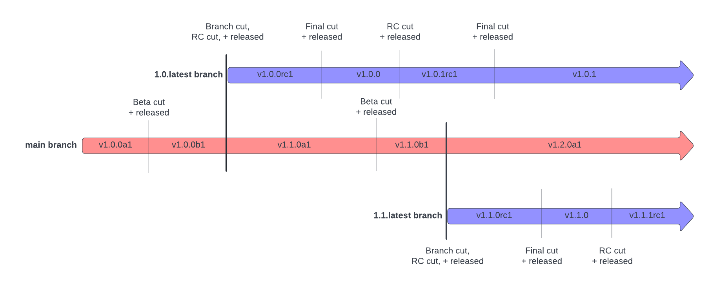

# Release Versioning / Branching Strategy

## Context
With `dbt` ever evolving and progressing, we continue to ship and release versions on a regular basis. As we release `dbt`, versioning and branching become key to identifying what is different for users and conveying the expectations of those changes. We currently push all our commits to `main` which is the latest version of our code. We don't always want to release the latest version of our code though. We want to be able to isolate commits to go into particular releases based on urgency (e.g. bug fixes) and stability (e.g. new features). 

We already have an established versioning strategy when it comes to major/minor/patch releases. The following is our approach as to what to expect from each release version:

* Major version: This signifies that breaking changes which require user action are included in this release.
* Minor version: This signifies that new features are included in this release.
* Patch version: This signifies that bug and security fixes are included in this release.

We need a versioning strategy that allows us to to convey to users the confidence and stability of code they are installing. We want a versioning strategy that allows users to try out new changes, and experiment with them to get early feedback. We want to make sure users can also get a preview of new features we are working on, so they can incorporate these changes into their work as soon as possible. 

We need a branching strategy to support the goals of the versioning strategy. We do not want to have to stop development on `main` as we await a release, nor do we want every change in `main` published in every release. Using branches, we can decide which changes go into which release.

## Common Terminology
* Release version: refers to the numeric value of the release (eg. `1.0.1`, `0.21.0`) There are major, minor, and patch release versions that map to standard [semantic versioning practices](https://semver.org/#semantic-versioning-200).
* Release phase: refers to the stability of the release (eg. beta, rc, final). 

## Requirements
The following are requirements that must be met for releasing dbt:

1. We must have major, minor, and patch releases.
1. We must have release phases that have the goal of garnering early feedback from the Community.
1. We must have release phases that aim to identify bugs and test for stability.
1. We must have release phases that are stable and of production quality.
1. We must have the ability to isolate changes from different versions and phases to release.
1. A version of `dbt-core` is considered released when it is available on GitHub Releases, PyPi, GitHub Container Registry, and Homebrew. This also applies to the individual `dbt` adapters. Otherwise, a version is considered partially released if only on a subset of those platforms.

## Branching Strategies Considered
The 2 branching strategies we are considering using going forward are:
	1. A new branch for each and every release
	1. A new branch for each minor version which we release minor and patch versions from (current strategy)

### New branch for every release
#### Pros: 
* Easy mapping between a release and a branch. Great for troubleshooting issues.
* Less confusing and more straightforward for running a release on a branch. No question of what version is being released.
#### Cons:
* Breaks current adapters CI which needs to point to the exact `dbt-core` branch that it needs to test with. The branches would need to be updated in all adapter repos for each final and prerelease branch every time we have a new release branch for `dbt-core`. 
* Confusing for backporting. We will need to keep creating new labels and making sure we remove the old labels because we don't want to accidently backport to the wrong branch.

### Minor release branches (current strategy)
#### Pros:
* Adapter CI testing will continue to work with this strategy and makes it less complicated overall. Adapters and `dbt-core` need to be on the same minor version but can be on different patch versions. The current CI workflows verify that the changes slated for a new `1.1` patch are compatible across all repos by checking out the `1.1.latest` branch of each repo. The 1:1 mapping of adapter branches to `dbt-core` branches makes this easy.
* Easy backporting. There is no need to figure out the exact branch that you need to backport to and accidently backporting to an older, stale branch.
#### Cons:
* Branches contain more than 1 release which is confusing. Without a 1:1 mapping between branch and release, you must rely on tags instead to know where in the branch the release was cut.
* Releasing from the same branch multiple times can lead to confusion as to which version we are releasing. A branch named for the specific version could be extracted and used to run the bumpversion script instead of relying on human input at release time.

## Decisions

### Version phases

 Header Explanations: 

- phases: defined in [Common Terminology](#common-terminology)
- Released?: do we plan to release this phase to GitHub, PyPi, etc.
- Branches: the branches where these release phases are present (e.g. betas should only exist on the `main` branch)
- Applicable Release Versions: the release versions where the release phase is applicable (i.e. we will only have alphas for major and minor versions, we will not have alphas for patch versions)
- Expectations: the stability of the code changes in the release

| Phase | Released? | Branches | Applicable Release Versions | Expectations |
| ---- | --------- | -------- | ---------------- | ------------ |
| Alpha | No | `main` | Major / Minor | Experimental |
| Beta | Yes | `main` | Major / Minor | Experimental |
| RC | Yes | Release branch | Major / Minor / Patch | Pre-production |
| Final | Yes | Release branch | Major / Minor / Patch | Production |

### Branching Strategy
Based off of the release version and expectations, the version phase's branching strategy can be determined. 
 * Alpha and Beta versions are experimental, and therefore exist only on the `main` branch, where all our changes reside
 * Alpha versions are never released. They signify that development is underway, though the changes they contain have not been released in any form
 * A Release Candidate (RC) version denotes a more stable state. A release branch will be created for RC releases to limit the changes a release contains
 * Final versions are stable and tested. Only verified changes will go into these releases, which are inherited from the corresponding RC version
 * A release branch will exist for each unique major or minor version, to be named accordingly: `<major>.<minor>.latest` (e.g. `1.0.latest`)
    * This is keeping with our current stratgey that we use today.
    * The reasoning for this decision is largely based off of not wanting to break the current adapters CI workflows and needing to redesign these as well. With patch versions of adapters and `dbt-core` needing to be compatible, testing off of a single minor version branch is much simpler. 
    * Making this current decision does not back us into a corner if we would like to revisit this again in the future. The release workflows created will be able to run on a branch that is version specific or not which makes this flexible as we test out our new processes.
    

 

### Changes for Specific Release Versions
There will be times that we will want to target changes to go into specific release versions. Below outlines 2 different scenarios in which this can occur and how we will approach them.

1. If a release branch already exists: This is the most common scenario where we want to add a change to an upcoming release and the release branch has already been cut. In this instance, developers will commit their changes to `main` first. Those changes (or some form of them) will then be applied to the release branch in question so that they can be included in the specific release version. 
\* Disclaimer: the how and when to apply changes to a release branch will be covered in another upcoming ADR.

1. If a release branch is not yet cut: This is the scenario where we start to develop a feature for a future version before we have cut a release branch for the upcoming version (eg. we want to work on a feature for `1.2.0` but we haven't cut the release branch for `1.1.0` yet). 
    1. Is this dead code? If so, then commiting the changes to `main` is acceptable. There must be 0 risk of users hitting this so if unsure, please use the alternative option.
    1. Use a feature branch until the release branch is cut. Then when it makes sense, merge the feature branch into `main` and continue development.

   ** Sometimes feature flags are used by teams to also achieve this goal. In our case, feature flags aren't controlled by the team and instead dependent of a user to toggle them on/off. Core uses feature flags instead for offering experimental functionality for users to try and test out. This is different from hiding features from going into certain releases.

## Status
Completed

## Consequences
This doesn't drastically change our current versioning or branching strategies, but documents our existing flows.

The only real change here is the addition of an Alpha release, the intent of which is to make developing across multiple repos easier. `dbt-core` and adapters should depend on minor versions. If we don't have a way to keep the `main` branches in sync with one another, integration tests will start to fail. It is also confusing when the `main` branch is marked as an RC or Final version when we never release from `main`. This change provides visibility around which versions live where.

## Outside Scope
The following are topics that are outside the scope of this document and will be addressed in their own ADR:
* Hotfixes and their branching strategies
* How and why we bump release versions right before a release.
* How and when do we backport changes to release branches
