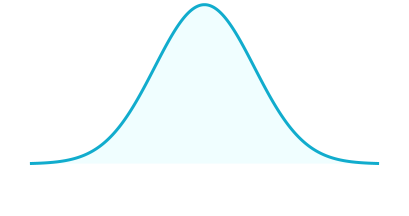

# Performance Regression Testing

## Attention!

PLEASE READ THIS README IN THE MAIN BRANCH
The performance runner is always pulled from main regardless of the version being modeled or sampled. If you are not in the main branch, this information may be stale.

## Description

This test suite samples the performance characteristics of individual commits against performance models for prior releases. Performance is measured in project-command pairs which are assumed to conform to a normal distribution. The sampling and comparison is effecient enough to run against PRs.

This collection of projects and commands should expand over time to reflect user feedback about poorly performing projects to protect against poor performance in these scenarios in future versions.

Here are all the components of the testing module:

- dbt project setups that are known performance bottlenecks which you can find in `/performance/projects/`, and a runner written in Rust that runs specific dbt commands on each of the projects.
- Performance characteristics called "baselines" from released dbt versions in `/performance/baselines/`. Each branch will only have the baselines for its ancestors because when we compare samples, we compare against the lastest baseline available in the branch. 
- A GitHub action for modeling the performance distribution for a new release: `/.github/workflows/model_performance.yml`.
- A GitHub action for sampling performance of dbt at your commit and comparing it against a previous release: `/.github/workflows/sample_performance.yml`.

At this time, the biggest risk in the design of this project is how to account for the natural variation of GitHub Action runs. Typically, performance work is done on dedicated hardware to elimiate this factor. However, there are ways to integrate the variation in obeservation tools if it can be measured.

## Adding Test Scenarios

A clear process for maintainers and community members to add new performance testing targets will exist after the next stage of the test suite is complete. For details, see #4768.

## Investigating Regressions

If your commit has failed one of the performance regression tests, it does not necessarily mean your commit has a performance regression. However, the observed runtime value was so much slower than the expected value that it was unlikely to be random noise. If it is not due to random noise, this commit contains the code that is causing this performance regression. However, it may not be the commit that introduced that code. That code may have been introduced in the commit before even if it passed due to natural variation in sampling. When investigating a performance regression, start with the failing commit and working your way backwards.

Here's an example of how this could happen:

```
Commit
A      <- last release
B
C      <- perf regression
D
E
F      <- the first failing commit
```
- Commit A is measured to have an expected value for one performance metric of 30 seconds with a standard deviation of 0.5 seconds.
- Commit B doesn't introduce a performance regression and passes the performance regression tests.
- Commit C introduces a performance regression such that the new expected value of the metric is 32 seconds with a standard deviation still at 0.5 seconds, but we don't know this because we don't estimate the whole performance distribution on every commit because that is far too much work to run on every commit. It passes the performance regression test because we happened to sample a value of 31 seconds which is within our threshold for the original model. It's also only 2 standard deviations away from the actual performance model of commit C so even though it's not going to be a super common situation, it is expected to happen sometimes.
- Commit D samples a value of 31.4 seconds and passes
- Commit E samples a value of 31.2 seconds and passes
- Commit F samples a value of 32.9 seconds and fails

Because these performance regression tests are non-deterministic, it is frequently going to be possible to rerun the test on a failing commit and get it to pass. The more often we do this, the farther down the commit history we will be punting detection.

If your PR is against `main` your commits will be compared against the latest baseline measurement found in `performance/baselines`. If this commit needs to be backported, that PR will be against the `.latest` branch and will also compare against the latest baseline measurement found in `performance/baselines` in that branch. These two versions may be the same or they may be different. For example, If the latest version of dbt is v1.99.0, the performance sample of your PR against main will compare against the baseline for v1.99.0. When those commits are backported to `1.98.latest` those commits will be compared against the baseline for v1.98.6 (or whatever the latest is at that time). Even if the compared baseline is the same, a different sample is taken for each PR. In this case, even though it should be rare, it is possible for a performance regression to be detected in one of the two PRs even with the same baseline due to variation in sampling.

## The Statistics
Particle physicists need to be confident in declaring new discoveries, snack manufacturers need to be sure each individual item is within the regulated margin of error for nutrition facts, and weight-rated climbing gear needs to be produced so you can trust your life to every unit that comes off the line. All of these use cases use the same kind of math to meet their needs: sigma-based p-values. This section will peel apart that math with the help of a physicist and walk through how we apply this approach to performance regression testing in this test suite.

You are likely familiar with forming a hypothesis of the form "A and B are correlated" which is known as _the research hypothesis_. Additionally, it follows that the hypothesis "A and B are not correlated" is relevant and is known as _the null hypothesis_. When looking at data, we commonly use a _p-value_ to determine the significance of the data. Formally, a _p-value_ is the probability of obtaining data at least as extreme as the ones observed, if the null hypothesis is true. To refine this definition, The experimental partical physicist [Dr. Tommaso Dorigo](https://userswww.pd.infn.it/~dorigo/#about) has an excellent [glossary](https://www.science20.com/quantum_diaries_survivor/fundamental_glossary_higgs_broadcast-85365) of these terms that helps clarify: "'Extreme' is quite tricky instead: it depends on what is your 'alternate hypothesis' of reference, and what kind of departure it would produce on the studied statistic derived from the data. So 'extreme' will mean 'departing from the typical values expected for the null hypothesis, toward the values expected from the alternate hypothesis.'" In the context of performance regression testing, our research hypothesis is that "after commit A, the codebase includes a performance regression" which means we expect the runtime of our measured processes to be _slower_, not faster than the expected value.

Given this definition of p-value, we need to explicitly call out the common tendancy to apply _probability inversion_ to our observations. To quote [Dr. Tommaso Dorigo](https://www.science20.com/quantum_diaries_survivor/fundamental_glossary_higgs_broadcast-85365) again, "If your ability on the long jump puts you in the 99.99% percentile, that does not mean that you are a kangaroo, and neither can one infer that the probability that you belong to the human race is 0.01%." Using our previously defined terms, the p-value is _not_ the probability that the null hypothesis _is true_.

This brings us to calculating sigma values. Sigma refers to the standard deviation of a statistical model, which is used as a measurement of how far away an observed value is from the expected value. When we say that we have a "3 sigma result" we are saying that if the null hypothesis is true, this is a particularly unlikely observation—not that the null hypothesis is false. Exactly how unlikely depends on what the expected values from our research hypothesis are. In the context of performance regression testing, if the null hypothesis is false, we are expecting the results to be _slower_ than the expected value not _slower or faster_. Looking at a normal distrubiton below, we can see that we only care about one _half_ of the distribution: the half where the values are slower than the expected value. This means that when we're calculating the p-value we are not including both sides of the normal distribution.



Because of this, the following table describes the significance of each sigma level for our _one-sided_ hypothesis:

| σ   | p-value        | scientific significance |
| --- | -------------- | ----------------------- |
| 1 σ | 1 in 6         |                         |
| 2 σ | 1 in 44        |                         |
| 3 σ | 1 in 741       |  evidence               |
| 4 σ | 1 in 31,574    |                         |
| 5 σ | 1 in 3,486,914 |  discovery              |

When detecting performance regressions that trigger alerts, block PRs, or delay releases we want to be conservative enough that detections are infrequently triggered by noise, but not so conservative as to miss most actual regressions. This test suite uses a 3 sigma standard so that only about 1 in every 700 runs is expected to fail the performance regression test suite due to expected variance in our measurements.

In practice, the number of performance regression failures due to random noise will be higher because we are not incorporating the variance of the tools we use to measure, namely GHA.

### Concrete Example: Performance Regression Detection

The following example data was collected by running the code in this repository in Github Actions.

In dbt v1.0.3, we have the following mean and standard deviation when parsing a dbt project with 2000 models:

μ (mean):   41.22<br/>
σ (stddev): 0.2525<br/>

The 2-sided 3 sigma range can be calculated with these two values via:

x < μ - 3 σ or x > μ + 3 σ<br/>
x < 41.22 - 3 * 0.2525 or x > 41.22 + 3 * 0.2525 <br/>
x < 40.46 or x > 41.98<br/>

It follows that the 1-sided 3 sigma range for performance regressions is just:<br/>
x > 41.98

If when we sample a single `dbt parse` of the same project with a commit slated to go into dbt v1.0.4, we observe a 42s parse time, then this observation is so unlikely if there were no code-induced performance regressions, that we should investigate if there is a performance regression in any of the commits between this failure and the commit where the initial distribution was measured.

Observations with 3 sigma significance that are _not_ performance regressions could be due to observing unlikely values (roughly 1 in every 750 observations), or variations in the instruments we use to take these measurements such as github actions. At this time we do not measure the variation in the instruments we use to account for these in our calculations which means failures due to random noise are more likely than they would be if we did take them into account.

### Concrete Example: Performance Modeling

Once a new dbt version is released (excluding pre-releases), the performance characteristics of that released version need to be measured. In this repository this measurement is referred to as a baseline.

After dbt v1.0.99 is released, a github action running from `main`, for the latest version of that action, takes the following steps:
- Checks out main for the latest performance runner
- pip installs dbt v1.0.99
- builds the runner if it's not already in the github actions cache
- uses the performance runner model sub command with `./runner model`.
- The model subcommand calls hyperfine to run all of the project-command pairs a large number of times (maybe 20 or so) and save the hyperfine outputs to files in `performance/baselines/1.0.99/` one file per command-project pair.
- The action opens two PRs with these files: one against `main` and one against `1.0.latest` so that future PRs against these branches will detect regressions against the performance characteristics of dbt v1.0.99 instead of v1.0.98.
- The release driver for dbt v1.0.99 reviews and merges these PRs which is the sole deliverable of the performance modeling work.

## Future work
- pin commands to projects by reading commands from a file defined in the project.
- add a postgres warehouse to run `dbt compile` and `dbt run` commands
- add more projects to test different configurations that have been known performance bottlenecks
- Account for github action variation: Either measure it, or eliminate it. To measure it we could set up another action that periodically samples the same version of dbt and use a 7 day rolling variation. To eliminate it we could run the action using something like [act](https://github.com/nektos/act) on dedicated hardware.
- build in a git-bisect run to automatically identify the commits that caused a performance regression by modeling each commit's expected value for the failing metric. Running this automatically, or even providing a script to do this locally would be useful.
